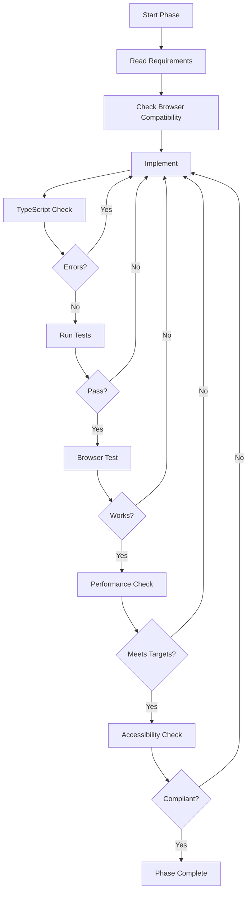

# Plan 9: Quality Assurance Guide

Comprehensive quality assurance procedures to ensure perfect implementation.

## Quality Philosophy

**First-Time-Right Principle**: Every implementation must pass all quality gates before being considered complete. No technical debt, no "fix later" items.

## Skill Integration for Quality

### 1. Bun Developer Skill
Use for all server-side quality:

```markdown
Before writing Bun.serve code:
1. Read bun-developer skill HTTP-SERVER.md section
2. Verify route handler patterns
3. Check WebSocket best practices
4. Confirm file I/O patterns

Quality Checks:
- Route handlers return Response objects
- Proper error handling in fetch()
- WebSocket lifecycle managed correctly
- File operations use Bun.file/Bun.write
```

### 2. CanIUse Docs Skill
Use for all browser compatibility:

```markdown
Before using any CSS/JS feature:
1. Read Resources/CanIUse/docs/features/{feature}.md
2. Verify 85%+ browser support
3. Check Safari-specific notes
4. Plan fallback if needed

Required Support Matrix:
| Browser | Minimum Version |
|---------|-----------------|
| Chrome | 106+ |
| Safari | 16+ |
| iOS Safari | 16+ |
| Brave | (follows Chrome) |
```

### 3. Claude Code Expert Skill
Use for Agent SDK integration:

```markdown
Before Agent SDK code:
1. Read AGENT-SDK.md section
2. Verify permission configuration
3. Check streaming patterns
4. Confirm session management

Quality Checks:
- Proper permission scoping
- Error handling for API failures
- Session state persistence
- Streaming event handling
```

## Quality Gates Per Phase

### Phase 1: Server Foundation
```yaml
gate_1_structure:
  - Directory structure matches plan
  - All files in correct locations
  - Imports resolve correctly

gate_2_server:
  - Server starts without errors
  - Routes respond with correct status codes
  - WebSocket upgrade works
  - Static files served correctly

gate_3_types:
  - TypeScript compiles
  - No 'any' types without justification
  - Proper return types on all functions

gate_4_tests:
  - Existing tests still pass
  - New endpoints have tests
  - WebSocket handler tested
```

### Phase 2: CSS Architecture
```yaml
gate_1_layers:
  - All 7 layers defined
  - Layers in correct priority order
  - All styles within layers

gate_2_tokens:
  - Design tokens comprehensive
  - Dark/light themes complete
  - Fluid typography working
  - Spacing scale consistent

gate_3_features:
  - Container queries work
  - :has() selectors function
  - CSS nesting compiles
  - Subgrid aligned

gate_4_compatibility:
  - Works in Chrome 106+
  - Works in Safari 16+
  - Works in iOS Safari 16+
  - Works in Brave
```

### Phase 3: View Transitions
```yaml
gate_1_detection:
  - Feature detection implemented
  - Fallback for unsupported browsers

gate_2_animations:
  - Transitions smooth (60fps)
  - Named transitions applied
  - Duration appropriate

gate_3_accessibility:
  - Reduced motion respected
  - No vestibular triggers
```

### Phase 4: Dialog Element
```yaml
gate_1_semantics:
  - Native <dialog> element used
  - Proper show/showModal usage
  - Close button functional

gate_2_styling:
  - Glass morphism applied
  - Backdrop styled
  - Animations smooth

gate_3_accessibility:
  - Focus trapped correctly
  - Escape closes dialog
  - Focus restored on close
```

### Phase 5: WebSocket Streaming
```yaml
gate_1_connection:
  - WebSocket connects
  - Upgrade handled correctly
  - Heartbeat implemented

gate_2_streaming:
  - Analysis streams correctly
  - Progress updates sent
  - Completion signaled

gate_3_resilience:
  - Reconnection works
  - Error handling complete
  - Cleanup on disconnect
```

### Phase 6-9: CRUD Services
```yaml
gate_1_api:
  - All endpoints respond
  - Proper HTTP methods
  - Error responses correct

gate_2_validation:
  - Input validated (Zod schemas)
  - Relationship integrity checked
  - UUID chains maintained

gate_3_persistence:
  - JSONL written correctly
  - Atomic operations
  - Rollback on failure
```

### Phase 10: Agent SDK
```yaml
gate_1_integration:
  - SDK imports correctly
  - Authentication works
  - Permissions configured

gate_2_sessions:
  - Start session works
  - Resume session works
  - Session state persisted

gate_3_streaming:
  - Events stream correctly
  - Progress updates sent
  - Completion handled
```

### Phase 11-14: UI & Performance
```yaml
gate_1_components:
  - All components render
  - State management works
  - Events handled correctly

gate_2_performance:
  - Lighthouse 90+ performance
  - LCP < 2.5s
  - FID < 100ms
  - CLS < 0.1

gate_3_virtual_scroll:
  - Large lists scroll smoothly
  - DOM nodes recycled
  - Memory stable
```

### Phase 15: Accessibility
```yaml
gate_1_keyboard:
  - All elements focusable
  - Focus order logical
  - Focus visible

gate_2_screen_reader:
  - ARIA labels complete
  - Live regions work
  - Announcements correct

gate_3_wcag:
  - AA compliance
  - Color contrast met
  - Motion preferences respected
```

### Phase 16: Testing
```yaml
gate_1_unit:
  - 80%+ code coverage
  - All functions tested
  - Edge cases covered

gate_2_integration:
  - API endpoints tested
  - WebSocket tested
  - Service integration tested

gate_3_e2e:
  - Critical paths tested
  - Cross-browser tested
  - Mobile tested
```

### Phase 17: Documentation
```yaml
gate_1_user_docs:
  - README updated
  - Usage instructions clear
  - Configuration documented

gate_2_api_docs:
  - All endpoints documented
  - Request/response schemas
  - Error codes listed

gate_3_developer:
  - Architecture documented
  - Extension points noted
  - Contributing guide
```

## Quality Metrics Dashboard

Track these metrics throughout implementation:

```markdown
## Implementation Metrics

### Code Quality
- TypeScript Errors: 0
- ESLint Warnings: 0
- Test Coverage: 80%+
- Cyclomatic Complexity: <10

### Performance
- Lighthouse Performance: 90+
- Lighthouse Accessibility: 100
- Bundle Size: <150KB
- First Contentful Paint: <1.5s

### Compatibility
- Chrome: ✅
- Safari: ✅
- iOS Safari: ✅
- Brave: ✅

### Accessibility
- WCAG Level: AA
- Keyboard Navigable: ✅
- Screen Reader Tested: ✅
- Color Contrast: ✅
```

## Continuous Quality Process



## Issue Resolution Protocol

When quality gates fail:

1. **Stop** - Do not continue implementation
2. **Diagnose** - Identify root cause
3. **Fix** - Address the issue
4. **Verify** - Re-run failed gate
5. **Document** - Note the fix for future reference
6. **Continue** - Only after gate passes

## Quality Review Checklist

Before marking any phase complete:

```markdown
- [ ] All code compiles without errors
- [ ] All tests pass
- [ ] Browser compatibility verified
- [ ] Performance metrics met
- [ ] Accessibility requirements satisfied
- [ ] Documentation updated
- [ ] No TODO comments left
- [ ] No console.log statements
- [ ] Error handling complete
- [ ] Edge cases covered
```
